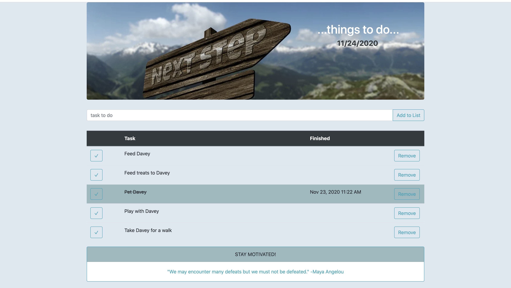

# PROJECT NAME

WEEKEND SQL TO DO LIST

## Description

_Duration: 9 hours

This is a 'TO DO' application that allows the user to create a task, which is added and stored in a database. There are options to check the task as completed, to uncheck it, and delete it from the list. 

## Screen Shot

### Prerequisites

Link to software that is required to install the app (e.g. node).

- [Node.js] - install in terminal
- [express] - install in terminal
- [postgres] - install in terminal
- [moment] - install in terminal

## Installation

How do you get your application up and running? This is a step by step list for how another developer could get this project up and running. The good target audience in terms of knowledge, would be a fellow Primer from another cohort being able to spin up this project. Note that you do not need a paragraph here to intro Installation. It should be step-by-step.

If your application has secret keys (for example --  Twilio), make sure you tell them how to set that up, both in getting the key and then what to call it in the `.env` file.

1. Create a database named `your database name`,
2. The queries in the `database.sql` file are set up to create all the necessary tables and populate the needed data to allow the application to run correctly. The project is built on [Postgres](https://www.postgresql.org/download/), so you will need to make sure to have that installed. We recommend using Postico to run those queries as that was used to create the queries, 
3. Open up your editor of choice and run an `npm install` - this will install `express`, `node.js`, `jQuery`, `moment` and `pg`.
4. Input in the package.json `"start": "node server/server.js"` - under scripts.
5. Run `npm start` in your terminal.
6. Open localhost:5000 in your browswer to use the application.

## Usage

1. Input your todo tasks into the input box - they will display on the DOM.
2. When a task is completed, check the marked box on the far left. - There will be a display change to recognize the task has been checked - and the date and time that you have completed the task will display.
3. If you accidentally check a task as completed, but have not completed it, click the check marked box again and it will return to an incomplete status.
4. When you want to remove a task from the list, there is a delete button on the fart right to press and a safety catch if you accidentally press it to ensure you mean to remove it.

## Built With

List technologies and frameworks here
- jQuery
- javaScript
- HTML/CSS
- Bootstrap
- Sweetalert
- moment
- node
- express
- postgres

## License

## Acknowledgement

Thank you to Josie, for being my coding buddy. Thank you to Steven and James for supporting me and answering my questions as well. My Vatti team this week, thank you to Brady and Julian, and again, Josie for working through this process together. Thanks to [Prime Digital Academy](www.primeacademy.io) who equipped and helped me to make this application a reality. Special thanks to my primary instructor, [Mary Mossman](https://github.com/mbMosman)
-[Josie Fredericksen](https://github.com//freder48)
-[Brady Baker](https://github.com//bradybaker)
-[Julian Booher](https://github.com//julianbooher)
-[Steven Maloney](https://github.com//sdeda1us)
-[James Posey](https://github.com//jposeyjr)

## Support

If you have suggestions or issues, please reach out to me on linkedIn [https://www.linkedin.com/in/kimberly-orchard-she-her/]

